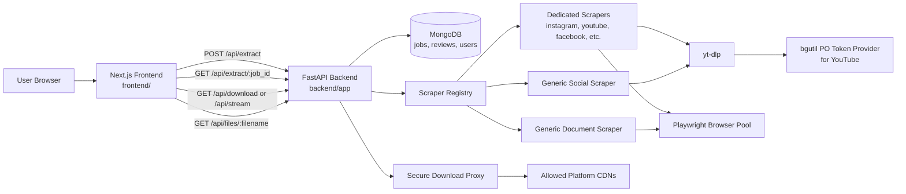
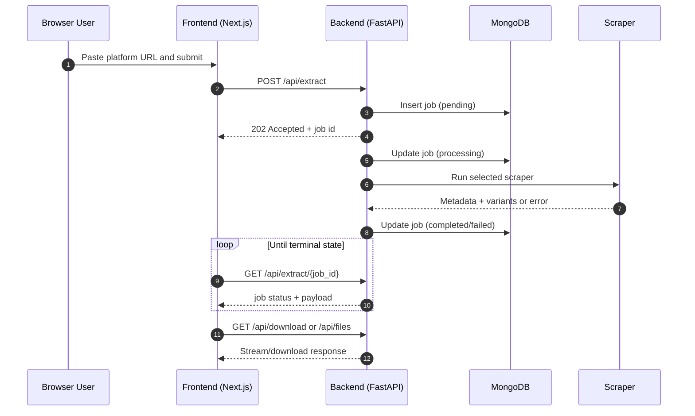
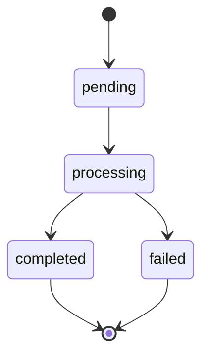

# Extractify

Extractify is a full-stack media and document extraction platform.
It accepts a public URL from supported platforms, detects the content type, runs platform-specific scraping in the backend, and returns downloadable variants through secure proxy endpoints.

## Contents

- [What This Repo Contains](#what-this-repo-contains)
- [Architecture](#architecture)
- [Extraction Lifecycle](#extraction-lifecycle)
- [Job State Model](#job-state-model)
- [Supported Platforms](#supported-platforms)
- [Tech Stack](#tech-stack)
- [Repository Layout](#repository-layout)
- [Quick Start (Local Development)](#quick-start-local-development)
- [Quick Start (Docker)](#quick-start-docker)
- [Environment Variables](#environment-variables)
- [API Overview](#api-overview)
- [Testing](#testing)
- [Security Notes](#security-notes)
- [Deployment](#deployment)
- [Troubleshooting](#troubleshooting)

## What This Repo Contains

- `frontend/`: Next.js 16 + React 19 app (URL input, platform pages, previews, downloads, localization)
- `backend/`: FastAPI + Beanie/MongoDB API (job lifecycle, scraper orchestration, secure download proxy)
- `bgutil-ytdlp-pot-provider/`: bundled upstream provider source used for YouTube PO token workflows
- `docker-compose.yml`: production-oriented container orchestration
- `render.yaml`: backend deployment blueprint for Render

## Architecture



## Extraction Lifecycle



## Job State Model



## Supported Platforms

Extractify supports both social and document/publication platforms via dedicated scrapers and generic fallbacks.

### Social

- Instagram
- YouTube
- Facebook
- TikTok
- Twitter/X
- Snapchat
- LinkedIn
- Pinterest
- Reddit
- Threads
- Tumblr
- Twitch
- Vimeo
- VK
- SoundCloud
- Telegram

### Document / Publication

- Scribd
- SlideShare
- Issuu
- Calameo
- Yumpu
- SlideServe

Notes:
- Some sources require session cookies or platform-specific auth values for private/authenticated content.
- YouTube extraction reliability is improved by running the PO token provider (`bgutil-ytdlp-pot-provider`).

## Tech Stack

| Layer | Technology |
|---|---|
| Frontend | Next.js 16, React 19, TypeScript, Tailwind CSS 4 |
| Backend API | FastAPI, Pydantic v2, Uvicorn |
| Data | MongoDB, Motor, Beanie ODM |
| Scraping | yt-dlp, Playwright, httpx, BeautifulSoup |
| Media tooling | ffmpeg (for merge/download workflows) |
| Infra | Docker, Docker Compose, Render blueprint |

## Repository Layout

```text
extractify/
├─ backend/
│  ├─ app/
│  │  ├─ routes/        # API endpoints: extract, download, files, health, reviews
│  │  ├─ services/      # Scraper registry + platform scrapers
│  │  ├─ models/        # Beanie document models
│  │  └─ utils/         # browser pool, yt-dlp helper, URL detection
│  ├─ tests/            # pytest suite
│  └─ Dockerfile
├─ frontend/
│  ├─ src/app/          # App Router pages
│  ├─ src/components/   # UI components
│  ├─ src/lib/          # platform map, i18n, helpers
│  └─ Dockerfile
├─ bgutil-ytdlp-pot-provider/
├─ docker-compose.yml
├─ docker-compose.dev.yml
└─ render.yaml
```

## Quick Start (Local Development)

### 1. Backend

```bash
cd backend

# Create virtual environment
python -m venv .venv

# Activate (PowerShell)
.\.venv\Scripts\Activate.ps1

# Install dependencies
pip install -r requirements.txt

# Install browser runtime for Playwright
playwright install chromium

# Configure environment
copy .env.example .env

# Run API
uvicorn app.main:app --host 0.0.0.0 --port 8000 --reload
```

### 2. Frontend

```bash
cd frontend
npm ci

# Optional: create .env.local for client-side config
# NEXT_PUBLIC_API_BASE_URL defaults to http://localhost:8000 if unset

npm run dev
```

Frontend: `http://localhost:3000`  
Backend: `http://localhost:8000`  
API docs: `http://localhost:8000/docs`

### 3. Optional: Run PO Token Provider for YouTube

This is already handled inside the backend Docker image via `backend/start.sh`. For local non-Docker workflows:

```bash
cd bgutil-ytdlp-pot-provider/server
npm ci
npx tsc
node build/main.js
```

Default provider endpoint: `http://127.0.0.1:4416`

## Quick Start (Docker)

Create a root `.env` file (example):

```env
BACKEND_PORT=8000
FRONTEND_PORT=3000

# Frontend -> Backend URL used by browser code
NEXT_PUBLIC_API_BASE_URL=http://localhost:8000

# Backend runtime config
APP_ENV=production
DEBUG=false
CORS_ORIGINS=["http://localhost:3000"]
MONGO_URI=mongodb+srv://<user>:<password>@<cluster>.mongodb.net/?retryWrites=true&w=majority
MONGO_DB_NAME=extractify

# Optional
NEXT_PUBLIC_GTM_ID=
```

Then run:

```bash
docker compose up -d --build
docker compose ps
```

## Environment Variables

### Backend (`backend/.env`)

Core:
- `APP_ENV` (`development` or `production`)
- `APP_HOST`, `APP_PORT`, `DEBUG`
- `CORS_ORIGINS`
- `MONGO_URI`, `MONGO_DB_NAME`

Optional auth/cookies:
- `YTDLP_COOKIES_FILE`
- `INSTAGRAM_SESSION_ID`, `INSTAGRAM_CSRF_TOKEN`, `INSTAGRAM_DS_USER_ID`
- `FACEBOOK_C_USER`, `FACEBOOK_XS`
- `TWITTER_AUTH_TOKEN`, `TWITTER_CSRF_TOKEN`, `TWITTER_BEARER_TOKEN`
- `THREADS_COOKIES_FILE`, `THREADS_POST_DOC_ID`, `THREADS_USER_DOC_ID`, `THREADS_APP_ID`
- `TUMBLR_API_KEYS`

### Frontend (`frontend/.env.local`)

- `NEXT_PUBLIC_API_BASE_URL` (defaults to `http://localhost:8000`)
- `NEXT_PUBLIC_GTM_ID` (optional)

## API Overview

Base URL: `http://localhost:8000`

| Method | Endpoint | Purpose |
|---|---|---|
| `GET` | `/health` | Health + MongoDB connectivity |
| `POST` | `/api/extract` | Create extraction job |
| `GET` | `/api/extract/{job_id}` | Poll extraction status/result |
| `GET` | `/api/platforms` | List supported platform metadata |
| `GET` | `/api/download` | Secure file download proxy |
| `GET` | `/api/stream` | Secure media stream proxy |
| `GET` | `/api/download/merge` | Merge multiple media segments into MP4 |
| `GET` | `/api/files/{filename}` | Serve generated local files (PDF/text/images) |
| `POST` | `/api/reviews` | Save user review |

### Example: Create an Extraction Job

```bash
curl -X POST "http://localhost:8000/api/extract" \
  -H "Content-Type: application/json" \
  -d '{
    "url": "https://www.instagram.com/reel/abc123/",
    "platform": "instagram",
    "tab": "Reels"
  }'
```

Expected response shape:

```json
{
  "id": "...",
  "url": "...",
  "platform": "instagram",
  "content_category": "social",
  "tab": "Reels",
  "status": "pending",
  "error_message": null,
  "extracted": null,
  "created_at": "2026-01-01T00:00:00Z",
  "updated_at": "2026-01-01T00:00:00Z"
}
```

## Testing

Backend tests:

```bash
cd backend
pytest
```

Run a single test file:

```bash
pytest tests/download_security_test.py
```

Frontend lint:

```bash
cd frontend
npm run lint
```

## Security Notes

- Download and stream proxy routes enforce:
  - strict host allow-list
  - scheme and port validation
  - DNS resolution checks against private/internal IPs
  - redirect re-validation on each hop
- File serving endpoint (`/api/files/{filename}`) restricts filenames and prevents path traversal.
- Cookie and auth values should always be provided through environment variables, never hardcoded.

## Deployment

- Backend can be deployed on Render using `render.yaml`.
- Frontend can be deployed separately (for example Vercel, Render, or container platform).
- In production, configure:
  - `MONGO_URI` to a managed MongoDB instance
  - `CORS_ORIGINS` to your frontend domain(s)
  - `NEXT_PUBLIC_API_BASE_URL` to your public backend URL

## Troubleshooting

### Backend returns `Database is not available`

- Verify `MONGO_URI` and `MONGO_DB_NAME`
- Check MongoDB reachability from backend runtime
- Call `GET /health` and confirm `mongo: connected`

### YouTube extraction fails with bot/sign-in related errors

- Ensure PO token provider is running (`backend/start.sh` in Docker, or manual `bgutil` server locally)
- Keep `yt-dlp` and provider versions current

### Browser download fails for direct CDN URLs

- Use backend proxy endpoints (`/api/download` or `/api/stream`) instead of direct cross-origin links

## Responsible Use

Use Extractify only for content you own or are authorized to access and download. You are responsible for complying with platform terms, copyright law, and local regulations.